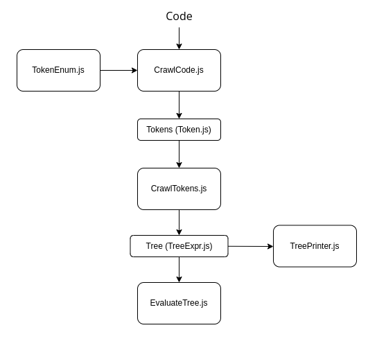

## 💻 Projeto

Projeto desenvolvido para cadeira de Paradigmas de Programação, da graduação de Ciência da Computação da Unisinos. Consiste em um interpretador de uma linguagem de expressões, foi baseado nesta literatura [Crafting Interpreters](https://craftinginterpreters.com/contents.html) e codado em JavaScript.

## ⚙ Execução

```bash
# instalar as dependências
yarn start
# ou
npm install

# executar o código
yarn
# ou
npm start
```

## 📖 Fluxograma

<p align="center">
  
</p>

## 💻 Código

A execução se inicia no `index.js`, no qual o módulo [fs](https://nodejs.dev/learn/the-nodejs-fs-module) é utilizado para ler os arquivos texto para execução dos códigos, e a biblioteca [chalk](https://github.com/chalk/chalk) é utilizada para customizar as informações exibidas no terminal.

### `TokenEnum.js`

Classe que define os lexemas, centraliza a definição das simbologias da linguagem, é a biblioteca do interpretador.

### `CrawlCode.js`

Classe que realiza o escaneamento, a interpretação, dos lexemas definidos e salva cada um na estrutura de tokens criada.

### `Token.js`

Classe que consiste na estrutura que armazena cada elemento do código.

### `CrawlTokens.js`

A partir dos tokens escaneados, essa é a classe principal que realiza o rastreamento dos mesmos, faz o parser e cria um objeto de uma árvore sintática que segue as determinadas ordens de precedência das operações. Nota-se que a lógica utilizada foi uma uma cascata com as funções, iniciando nas operações com menor precedência e indo até o final para iniciar o rastreamento nas operações de maior precedência.

### `TreeExpr.js`

Classe que define a gramática dos diferentes tipos de tokens, com os atributos conforme a estrutura que foi pensada para cada um.

### `TreePrinter.js`

A partir dos objetos das árvores sintáticas construídas, esta clase apenas serve para printar de maneira lógica, para melhor entendimento, a árvore de expressão com suas ordens de precedência.

### `EvaluateTree.js`

Classe que, para cada operação da árvore sintática construída, seguindo a ordem de precedência dos nodos, realiza a sua respectiva função, para, por fim, exibir o resultado.

### `MethodMap.js`

Arquivo que contém as funcionalidades de operações de métodos de palavras reservadas.
